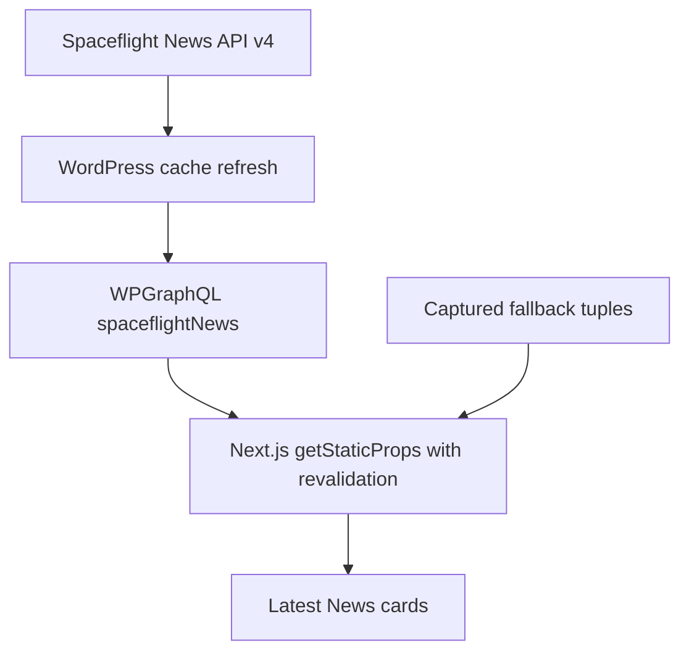

# Complete Figma Page Fidelity - Plan

## Goal Capsule

- **Objective:** finish the Figma fidelity pass by restoring missing copy, interactions, section composition, and the backend-backed Latest News presentation.
- **Product authority:** the supplied full-page PNG (SHA-256 `90D8D8CE52BDD7152742A3679EDEB520BEB52FFEF6CC7D9D65FF4F36CC528834`) is authoritative for desktop layout, typography, color, visible content, and visible control affordances. Existing accessible interaction patterns and backend cache behavior remain authoritative where the static design cannot define behavior.
- **Execution profile:** preserve the current Next.js, React, ACF, WPGraphQL, and Spaceflight News Cache architecture; extend existing rail and disclosure patterns instead of adding dependencies.
- **Stop conditions:** stop if a change requires inventing a new external destination or replacing the backend news contract.
- **Tail ownership:** implementation includes automated checks, desktop/mobile browser inspection, commit, push, and PR creation when tooling permits.

---

## Product Contract

### Summary

Complete the remaining homepage fidelity work so the LinkedIn, Partners, Awards, Latest News, newsletter, and contact/footer regions match the supplied design in content, placement, color, and behavior. Latest News must display the article tuples supplied by the WordPress Spaceflight News cache rather than substituting static card content.

### Problem Frame

The previous pass corrected the largest media mismatches, but several high-salience regions still diverge from the design. The partner presentation is a static grid, the awards table is incomplete and noninteractive, the final footer composition is split into unrelated bands, and some card imagery and copy do not remain coupled to backend news records.

### Requirements

#### Content Fidelity

- R1. Remove visible text artifacts and reproduce the LinkedIn heading, supporting copy, and call-to-action treatment from the supplied design.
- R2. Render all six Awards & Accreditations rows shown in the design with the correct year, type, and name values.
- R3. Render the final footer navigation labels, social links, office contact block, newsletter label, contact heading, and form treatment shown in the design.
- R4. Keep section headings, counts, labels, and body text centered, aligned, and colored according to their design region.

#### Interaction Fidelity

- R5. Present partners as a horizontally scrollable, numbered logo rail with accessible previous and next controls and disabled boundary states.
- R6. Make each award row an accessible selection control whose active state reveals its credential card and matches the highlighted design row.
- R7. Preserve working LinkedIn, client accordion, case rail, news rail, header menu, and reduced-motion behavior.

#### Backend News Integrity

- R8. Populate Latest News titles, summaries, dates, sources, links, and images from the `spaceflightNews` backend result when WordPress returns valid data.
- R9. Preserve the existing local captured-news fallback only for missing, failed, or invalid backend responses.
- R10. Keep the upstream flow cache-first: Spaceflight News API v4 feeds the WordPress cache, WPGraphQL exposes cached records, and Next.js renders those records without contacting the upstream API in the browser.
- R11. Treat an empty backend article array as an intentional empty state, but treat a non-empty payload containing no valid article tuples as invalid and use the captured fallback.

### Acceptance Examples

- AE1. Given a valid GraphQL article with a unique image URL and title, when Latest News renders, then the matching card uses that image and title rather than a position-based Figma crop.
- AE2. Given the fourth award row, when a user selects it by pointer or keyboard, then the row becomes visually active, `aria-expanded` is true, and the Quality credential panel is visible.
- AE3. Given the partner rail is at its start, when the page loads, then Previous is disabled and Next is enabled whenever more cards overflow the viewport.
- AE4. Given the desktop footer, when the final contact region is viewed, then the left navigation, center contact heading/form, newsletter marker, socials, and office details occupy the same shared band.
- AE5. Given a non-empty backend news payload whose records all fail normalization, when the page data is built, then the captured news fallback renders; given an explicit empty array, no fallback articles are injected.

### Scope Boundaries

- **In scope:** homepage components, fallback copy/data, frontend normalization and rendering, existing backend contract verification, CSS, interaction tests, and browser fidelity checks.
- **Deferred to follow-up work:** additional standalone routes for About, Services, Projects, News, FAQs, or accreditation detail pages.
- **Out of scope:** direct browser calls to Spaceflight News API, a new carousel package, CMS schema expansion, invented external URLs, and replacing the supplied design with a new visual direction.

---

## Planning Contract

### Key Technical Decisions

- KTD1. Reuse `useHorizontalRail` for Partners so its interaction model matches Featured Cases and Latest News.
- KTD2. Model award rows as buttons with one selected index and a design-matched detail card. Keep six canonical frontend rows as the visual authority, allow matching CMS fields to enrich them without deleting rows, and derive credential details from optional frontend-only fields so the ACF schema stays compatible.
- KTD3. Couple every news card to one `NewsArticle` tuple, including its `imageUrl`; design-cropped news images remain fallback data only.
- KTD4. Keep the image-led newsletter showcase above the footer, then recompose the final footer as one semantic contact band containing the left navigation, center contact form, right newsletter marker, socials, and office details.
- KTD5. Keep both email controls as real forms with native validation and an accessible submitted status. Until an endpoint exists, prevent network submission and report the unavailable submission state honestly rather than implying success.
- KTD6. Interpret `[36]` as the design's collaborator-total label, not as the number of locally available rail cards; number rendered cards independently and expose the total label accessibly.

### High-Level Technical Design

### Assumptions

- The supplied PNG contains enough detail to implement this pass because no PDF is present in the workspace and Figma rejected further MCP reads at the Starter-plan call limit.
- Partner cards may use the available partner records while the visible section count follows the design's total-collaborator label.
- Newsletter and contact fields have no submission endpoint; controls remain semantic and keyboard accessible, use native email validation, and expose a concise non-success status after a valid submission attempt.

### Risks & Dependencies

- The external Spaceflight News API contract can evolve; the existing backend normalizer, last-known-good cache, and GraphQL tests remain the compatibility boundary.
- The design is a 1440px desktop capture, so mobile behavior must preserve hierarchy and readability without forcing desktop geometry into narrow viewports.
- Footer labels with an existing section target link to `#about`, `#services`, `#cases`, `#contact`, or `#news`; labels without an owned destination remain text instead of invented links.

---

## Implementation Units

### U1. Restore awards data and interaction

- **Goal:** reproduce the six-row awards table and active credential treatment.
- **Requirements:** R2, R4, R6, R7; AE2.
- **Dependencies:** none.
- **Files:** `frontend/data/fallback.ts`, `frontend/lib/types.ts`, `frontend/components/sections/AwardsSection.tsx`, `frontend/styles/globals.css`, `frontend/tests/render.test.tsx`, `frontend/tests/cms.test.ts`.
- **Approach:** add the complete canonical design rows and credential details, preserve them when CMS blocks are partial, render semantic table labels, make rows selectable, and position the selected detail card without changing CMS-required fields.
- **Patterns to follow:** `frontend/components/sections/ClientsSection.tsx` disclosure semantics and local selected-state handling.
- **Test scenarios:** the complete row set renders; selecting a row moves the active state and detail content; keyboard activation works through native button behavior; only one detail panel is exposed.
- **Verification:** the awards region visually matches the supplied crop and remains usable at desktop and mobile widths.

### U2. Convert partners to the design rail

- **Goal:** match the partner composition and add the missing slider behavior.
- **Requirements:** R4, R5, R7; AE3.
- **Dependencies:** none.
- **Files:** `frontend/components/sections/PartnersSection.tsx`, `frontend/styles/globals.css`, `frontend/tests/render.test.tsx`.
- **Approach:** keep the intro in the left column, render numbered logo cards in an overflow rail, and add circular previous/next controls using the existing hook.
- **Patterns to follow:** `frontend/components/sections/CasesSection.tsx` and `frontend/components/sections/NewsSection.tsx` rail controls.
- **Test scenarios:** all available partners render in order; Previous is disabled at the start; Next scrolls the rail when overflow exists; controls expose useful accessible names.
- **Verification:** the desktop section shows the design's heading/count/intro/rail hierarchy and mobile cards remain horizontally reachable.

### U3. Preserve live backend news tuples

- **Goal:** ensure Latest News faithfully renders cached backend articles while retaining robust fallback behavior.
- **Requirements:** R7, R8, R9, R10; AE1.
- **Dependencies:** none.
- **Files:** `frontend/components/sections/NewsSection.tsx`, `frontend/lib/cms.ts`, `frontend/tests/render.test.tsx`, `frontend/tests/cms.test.ts`, `spaceflight-news-cache/tests/test-fetcher.php`, `spaceflight-news-cache/tests/test-graphql.php`.
- **Approach:** remove position-based media substitution, retain safe URL normalization, distinguish explicit-empty from non-empty-all-invalid responses, and strengthen tests that trace a sentinel upstream tuple through GraphQL normalization into one rendered card.
- **Patterns to follow:** `spaceflight-news-cache/includes/class-sfn-cache-fetcher.php` normalization and `frontend/lib/cms.ts` deterministic fallback.
- **Test scenarios:** valid backend article fields render together; mixed payloads keep valid records; unsafe URLs remain unavailable; explicit empty backend arrays remain valid; non-empty all-invalid payloads and failed requests retain fallback content; backend GraphQL reads never call upstream.
- **Verification:** frontend and PHP tests prove the cache-first data path, and browser cards show current article imagery/content when a backend endpoint is configured.

### U4. Rebuild LinkedIn and footer composition

- **Goal:** remove remaining text/presentation artifacts and match the final page regions.
- **Requirements:** R1, R3, R4, R7; AE4.
- **Dependencies:** none.
- **Files:** `frontend/components/sections/LinkedInSection.tsx`, `frontend/components/SiteFooter.tsx`, `frontend/data/fallback.ts`, `frontend/styles/globals.css`, `frontend/tests/render.test.tsx`.
- **Approach:** normalize visible symbols and copy, tune LinkedIn placement, keep the image collage, and combine footer navigation/contact/newsletter/social/address content into the design's final band. Use owned section anchors for available destinations, plain text for unavailable destinations, and tested form status behavior.
- **Patterns to follow:** existing `page-grid`, `SafeImage`, and native link/form semantics.
- **Test scenarios:** no mojibake or replacement text appears; footer navigation labels are present; email inputs have labels; empty and malformed emails fail native validation; a valid repeated submission attempt exposes the unavailable status without a network request; contact/social links retain valid destinations; mobile layout does not overlap.
- **Verification:** desktop and mobile browser screenshots show centered typography, correct contrast, and the complete final footer content.

### U5. Integrate and visually verify the full page

- **Goal:** validate the changed regions together and correct cross-section spacing or responsive regressions.
- **Requirements:** R1-R10; AE1-AE4.
- **Dependencies:** U1, U2, U3, U4.
- **Files:** `frontend/styles/globals.css`, `frontend/tests/render.test.tsx`, `frontend/tests/cms.test.ts`.
- **Approach:** run targeted checks while implementing, then run the aggregate release gate once; inspect the real page at `1440x900` and `390x844`, exercise every changed control, and make only fidelity fixes supported by the supplied design.
- **Test scenarios:** partner controls, award rows, client disclosures, menu, case/news rails, and external links remain interactive; all headings and content bands avoid overlap at both viewports; the rendered page reports `wordpress` provenance when a configured backend returns the sentinel tuple and reports fallback provenance when no backend is available.
- **Verification:** browser evidence and all repository release gates pass.

---

## Verification Contract

| Gate | Command | Done signal |
|---|---|---|
| Frontend types | `npm run typecheck` from `frontend/` | TypeScript exits cleanly. |
| Frontend behavior | `npm test` from `frontend/` | Component and CMS tests pass. |
| Frontend quality | `npm run lint` from `frontend/` | ESLint exits with zero warnings. |
| Production build | `npm run build` from `frontend/` | Next.js production build succeeds. |
| Backend cache contract | `php spaceflight-news-cache/tests/run.php` | Fetcher, store, REST, GraphQL, settings, and admin tests pass. |
| Full release gate | `powershell -ExecutionPolicy Bypass -File scripts/verify-release.ps1` | Combined release verification succeeds. |
| Browser fidelity | Desktop `1440x900` plus mobile `390x844` | Design regions align, controls work, text does not overlap, and live news tuples stay coupled; backend provenance is recorded rather than inferred visually. |

---

## Definition of Done

- The LinkedIn section contains no visible encoding artifacts and matches the supplied composition.
- Partners is a working, accessible horizontal slider with numbered cards and boundary-aware controls.
- Awards renders all six design rows and one interactive selected credential state.
- Latest News renders one coherent backend article tuple per card and preserves captured fallback behavior.
- The final footer contains the design's navigation, contact, newsletter, social, and office content in one responsive composition.
- Typecheck, tests, lint, build, backend tests, release verification, and browser checks pass.
- Experimental or abandoned styling and generated test artifacts are removed from the final diff.
- Changes are committed and pushed; a pull request is opened when repository tooling permits, otherwise the exact compare URL and blocker are reported.
